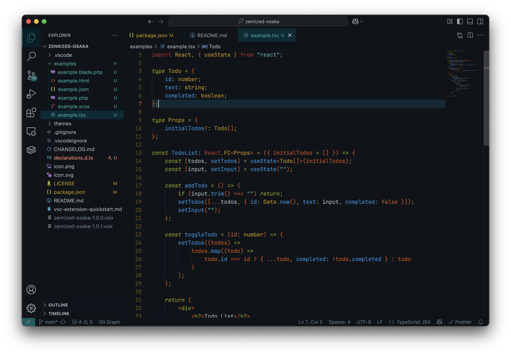
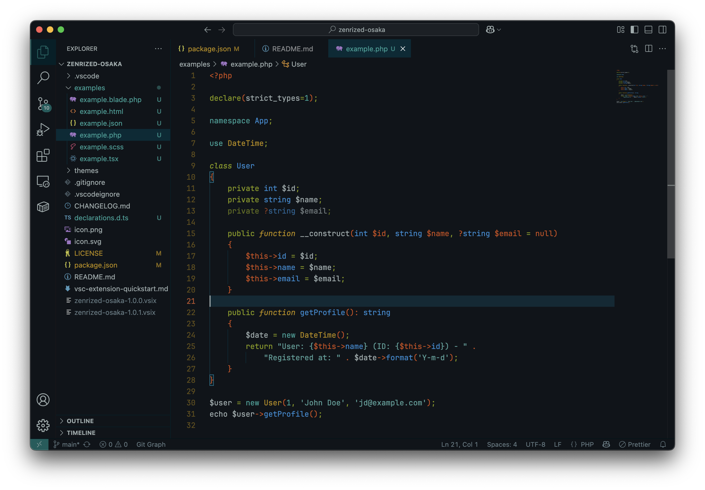
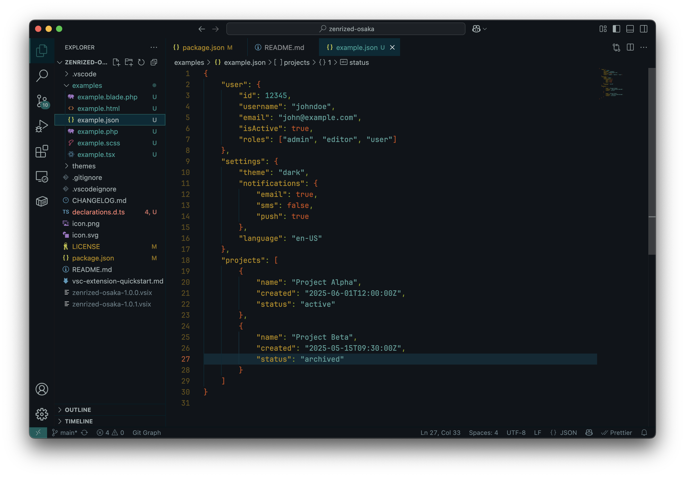

# Zenrized Osaka

[](https://vscode.dev/editor/theme/artemkee.zenrized-osaka)

Visual Studio Code theme inspired by [solarized-osaka.nvim](https://github.com/craftzdog/solarized-osaka.nvim)

## 📸 Screenshots

### Typescript



### PHP



### Object-like files (JSON, CSS, etc.)



## 📦 Installing

This extension is available for free in the [Visual Studio Code Marketplace](https://marketplace.visualstudio.com/items?itemName=Artemkee.zenrized-osaka)

## ⚙️ Suggest Editor Settings

```
"editor.fontSize": 14,
"workbench.tree.indent": 10,
"editor.fontFamily": "JetBrains Mono",
```

JetBrains Mono Download: [https://www.jetbrains.com/lp/mono](https://www.jetbrains.com/lp/mono)

## 💡 Contributing & Feedback

Found a bug or have a suggestion?  
Open an [issue](https://github.com/Artemkee/zenrized-osaka/issues) or submit a pull request!

## 📄 License

MIT © Artem Mozhaev (Artemkee)
